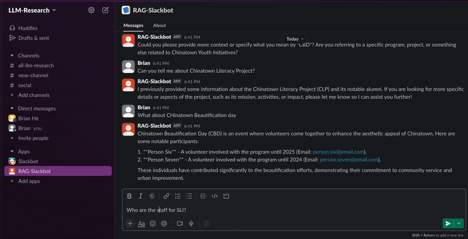

# CYI Agentic RAG Slackbot

> Agentic Retrieval‑Augmented Generation (RAG) chatbot that helps Chinatown Youth Initiatives (CYI) staff query organizational knowledge across Google Drive documents and structured directories.




<!-- Badges (optional) -->
<!-- []() []() -->

## Table of Contents
- [Overview](#overview)
- [Architecture](#architecture)
- [Key Features](#key-features)
- [Datasets & Sources](#datasets--sources)
- [Quick Start](#quick-start)
- [Configuration](#configuration)

## Overview
CYI’s knowledge lives across 20+ years of reports, curricula, and spreadsheets. High volunteer turnover, fragmented data, and lack of standardized data management make knowledge transfer difficult. This project delivers an **agentic RAG Slackbot** that:

- Pulls both **unstructured** chunks google documents and **structured** records from google sheets
- Answers FAQs grounded in CYI documents and tabular data
- Drafts program plans, training notes, and grant material from prior content
- Identifies data quality gaps (missing fields, duplication) through real usage

> This repo demontrates a skeleton prototype and reference implementation.

## Architecture
**Agentic pipeline** chooses the right tool based on the user query and conversation state:

- **CYIDocQA** (Retriever) → Chunk & summarize Google Drive documents (via ChromaDB + embeddings)
- **CYIDirectoryQA** (Text‑to‑SQL) → Natural‑language SQL over SQLite directories
- **Summarizer** → Post‑processing for coherent final answers


**Core stack**
- **LLM:** OpenAI `gpt-4o`
- **Embeddings:** `BAAI/bge-small-en-v1.5` (HuggingFace)
- **Data stores:** ChromaDB, SQLite
- **Orchestration:** LlamaIndex Agent
- **Interface:** Slack (Slack Bolt)

> See the [Architecture Overview](docs/Architecture.md) for additional details.

## Datasets & Sources
- **Unstructured:** Google Docs/Slides/PDFs (scoped subset), chunked with recursive split + metadata
- **Structured:** Google Sheets → SQLite tables
- **Metadata:** program name, year, doc type, filename, owner

> The repo includes **sample data** only. Real databases/files are ignored via `.gitignore`. See [Database Setup](docs/Database.md) for more details.

## Quick Start
First you'll need to set up a Slack app. See [setup](docs/Setup.md) for information.
```bash
# 1) Clone
git clone https://github.com/<org>/<repo>.git
cd <repo>

# 2) Python env (recommended)
python -m venv .venv && source .venv/bin/activate

# 3) Install dependencies
pip install -r requirements.txt

# 4) Environment variables and paths
cp .env.example .env

# 5) Run the app (local CLI / dev server)
python app/main.py
```

## Configuration
Create a `.env` file:
```dotenv
# LLM and Embeddings
OPENAI_API_KEY=...
EMBEDDING_MODEL=BAAI/bge-small-en-v1.5

# Slack
SLACK_APP_TOKEN=xapp-...
SLACK_BOT_TOKEN=xoxb-...

# Google Drive
GDRIVE_FOLDER_ID=...
GDRIVE_TOKEN_PATH=./token.json
GDRIVE_CREDENTIALS_PATH=./credentials.json
```

---

### Acknowledgments
- Chinatown Youth Initiatives (CYI)

