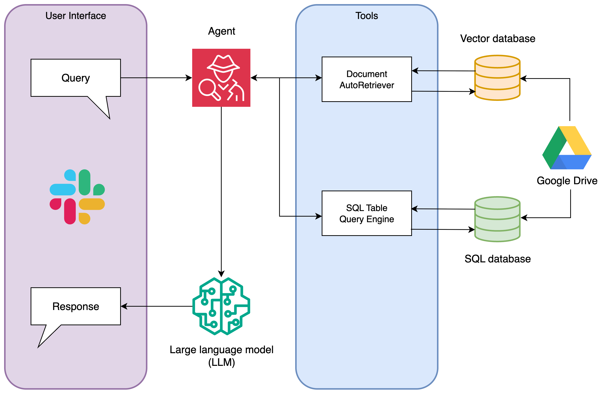

# Architecture
> Deep dive into the Agentic RAG Slackbot for CYI — components, data flow, prompts, indexes, and operational concerns.

## 1) System Overview
- **Interface:** Slack (Bolt)
- **Orchestration:** LlamaIndex OpenAI Agent with tools
- **Data Stores:** ChromaDB (vectors), SQLite (structured data)
- **Tools:** Document retriever, text-to-sql
- **Models:** OpenAI `gpt-4o` (LLM), `BAAI/bhe-small-en-v1.5` (embeddings)
- **Observability**: Phoenix traces

### Diagram


---

## 2) Data Sources & Schemas
> In order to protect the organization's data confidentiality, sample data and schemas are provided as reference only. Please refer to [Database.md](Database.md) for additional details. 

### 3.1 Unstructured (Docs)
- Ingestion from Google Drive (scoped subsets)
- Supported types: Google Docs/Slides/PDFs; converted to text chunks
- **Metadata (sample)**: `program`, `year`, `doctype`, `owner`, `file`, `page/slide`, `source_url`

### 3.2 Structured (SQLite)
- Tables (sample): `Alumni`
- **Alumni (sample)**
  - `id` (PK), `first_name`, `last_name`, `email`, `program`, `year`, `notes`

---

## 3) Retrieval Pipeline (Document AutoRetriever QA)
- **Tool(s):** `CYIDocQA`
- **Index**: `VectorStoreIndex` on top of Chroma `collection="quickstart"`
- **Embeddings:** `BAAI/bge-small-en-v1.5`
- **Chunking:** recursive split; target ~512 tokens; overlap;
- **Query:** cosine similarity with top‑k (k=8) with metadata awareness from `VectorStoreInfo`
- **Answering:** retrieved nodes -> summarized answer

If the retrieval pipeline is selected by the agent, the provided user query is transformed into a vector embedding using the same `bge-small-en-v1.5` that the document chunks were mapped with. Based on the cosine similarity between the query and the chunks in the vector database, the top k=8 chunks will be returned and used as context to a large language model, ie. GPT o4, for answering the user query. Finally this response is sent back to the user on Slack.

---

## 5) Text‑to‑SQL Pipeline (Directory QA)
- **Engine:** `sqlite://cyi_directory.db`
- **Tables included:** `["Alumni"]` (sample)
- **Prompt guardrails (org-specific):**
  - Read‑only
  - Map programs: SLI, CCB, CBD, CLP
  - Map staff to roles: Director, Coordinator, Facilitator, etc.

If the text-to-sql pipeline is selected by the agent, `NLSQLTableQueryEngine` is used to turn the user provided text into a sql query. The query is then executed with respect to the database and the output is summarized by a large language model into concise text and provided to the user as a response via Slack.

---

## 6) Agent & Tool Routing
- **Tools registered:** `CYIDocQA`, `CYIDirectoryQA`,
- **Routing policy:**
- **System prompt (current behavior):**
    - Prefer SQL for structured queries (people/roles/years)
    - Use Doc QA for report content questions
    - Handle follow-ups using conversational context (e.g., “what about 2022?” inherits prior program)
    - Memory: short window buffer (can extend if needed)
**Skeleton (LlamaIndex Agent):**
```python
 agent = OpenAIAgent.from_tools(
        tools=[retrieve_summarize_tool, sql_summary_tool],
        llm=Settings.llm,
        system_prompt=...)
```

---

## 7) Observability & Evaluation
- **Phoenix**: traces, spans, tool invocations, latency distribution
- Prompt set for testing:
    - SQL: roles by program/year, coordinators by year, multi-year counts, etc.
    - Document QA: event locations, speakers, themes, logistics, etc.

---

## 8) Future Work
- Add reranker for improved doc QA ordering
- Expand SQL scope with more structured data
- Intent classifier to improve agent tool routing
- Per-document permissions and Slack user mapping